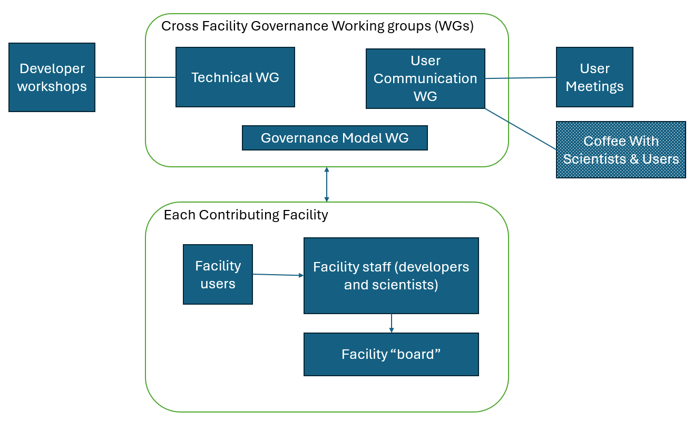
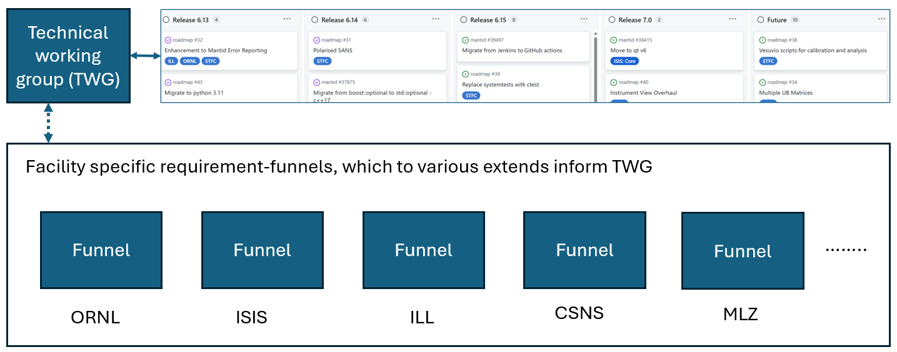

# Mantid Collaboration Governance Model

Purpose of this document
========================

This document describes the governance model for the Mantid Collaboration.
The history of the governance is stored in the [history file](history.md).

Table of Contents
=================

- [Governance Model](#governance-model)
  - [General to all Working Groups](#general-to-all-working-groups)
  - [Process for Resolving Conflicts](#process-for-resolving-conflicts)
  - [Technical Working Group (TWG) and the Committed Collaborative Roadmap (CCR)](#technical-working-group-twg-and-the-committed-collaborative-roadmap-ccr)
  - [User Communication Working Group (UCWG)](#user-communication-working-group-ucwg)
  - [Governance Model Working Group (GMWG)](#governance-model-working-group-gmwg)
  - [Developer Workshop](#developer-workshop)
  - [User Meeting](#user-meeting)
  - [Coffee with Scientists and Users Meeting](#coffee-with-scientists-and-users-meeting)
- [Appendix: Example for interaction from a Contributing Facility](#appendix-example-for-interaction-from-a-contributing-facility)

Governance Model
================

The governance structure is developed to stimulate collaboration and resulting in open source code that is developed and maintained in a collaborative way.

Key to Mantid development, and two types of contributors:

* The Mantid Collaboration seeks to coordinate contributions to a free open source software (FLOSS) project.
* Facilities (Facilities in this context refers to research infrastructures such as ISIS, SNS and ILL) act as contributors to an open source software development.
This document refers to such facilities as "Contributing Facilities".
  * Mantid is open to new Contributing Facilities providing that those facilities conform to the terms listed in this document and can commit their own resources to develop the framework for their needs.
* Individual contributors are welcome and do not need to be a member of a facility.
They are referred to in this document as “Individual Contributors”.
  * Becoming an Individual Contributor is an open process as defined in this document. Contributions are not limited to code commits, and refer to any contributions that help the purpose of the collaboration.

**Fig 1. Representation of the interaction between the collaborative part (top box) and Contributing Facilities (bottom box). The three component next to the top box are described further below, where the shaded out component is optional to the governance model.**

Figure 1 shows a representation of how the cross facility part of the governance interact with each Contributing Facility.
The box labelled "Cross Facility Governance Working Groups (WGs)" shows the collaborations bodies, in the form of three Working Groups (WPs), which makes up the collaborative bodies of the governance model. 
The box labelled "Each Contributing Facility" shows a simplified map of the stakeholders of a Contributing Facility.
These include facility scientists, developers, users, and a "board" of some kind that oversees and prioritises Mantid needs for a single facility. The latter will vary from facility to facility, e.g. from a single developer and a couple of scientists meeting informally to discuss prioritises to a larger board with several science representatives helping to prioritise Mantid requirements across 20+ instruments for a larger facility development team.
It is not prescribed how such a "board" is run or setup, but it is assumed that contain communication happens between the Contributing facility and the cross facility WGs, as described in this document.

This governance model allows individual facilities to develop Mantid according to their own requirements, with accountability for delivery and resource management to their own executive management, while leverage collaboratively working where this is of mutually beneficial.

In short the Collaborative WGs in figure 1 are:

* The Technical Working Group (TWG) - maintain and update a Committed Roadmap and responsible for running Mantid Developer Workshops
* The User Communication Working Group (UCWG) - cover user communication not covered by other means and the facilitation of [User Meetings](#user-meeting) and optionally Coffee thing 
* The Governance Model Working Group (GMWG) - its purpose is to periodically review and update this document and governance model, including to check that it is not become out-of-date. This is meant to a WG in the lightest sense possible, periodically (e.g. yearly) review and update this governance model, with option to feed in ideas ongoingly.

Examples of local facility management is given in the Appendix.

**Contributing Facilities shall**
* Resource the development according to the required use by the facility (i.e. each Contributing Facility will have sufficient level of effort available to resource their own specific development of Mantid. As such the collaboration is a do-ocracy, in a similar way to other scientific software developments such as SASView (https://www.sasview.org/).).
* Provide own local management, requirement gathering process and development.
* Nominate members to WGs.
* Help Mantid products remain FLOSS.
* Adhere to the development workflow and standards for code quality set out by the Technical Working Group (TWG).
* Contribute to maintenance and testing activities.
* Be open to contributions, suggestions and feedback from Individual Contributors.

**Contributing Facilities should**
* Contribute to infrastructure costs.
* Maintain a level of effort, expertise or capability in Mantid.
* Host (and fund) User Meetings and Developer Workshops.

General to all Working Groups
------------------------------

All Working Groups (WGs) runs on a consensus driven basis and share several common aspects of working which is described in this section.

A primary aim of all WGs is to provide spaces for discussions between facilities to encourage coordination and collaboration.

**Membership.**

Each Contributing Facility can nominate at most two members per WG. New WP members are approved by the existing WP members.
A Contributing Facility is a facility that has dedicated developer resource (part time or full time) working on Mantid or is paying another Contributing Facility money to maintain and develop Mantid.
All meetings are open to guests in the form of Individual Contributors, people who have a special interest and knowledge of a topic, and facilities interested in experiencing the working of a WG before requesting membership or as part of considering becoming a Contributing Facility. 
Guests cannot cast votes where votes are held in WG meetings. Guest can self-nominate to attend WG meetings (for whom to contact see the WG membership lists) or be invited by a WG member (where this is not the chair please inform the chair ahead of the meeting the guest attend).
With regards to Individual Contributors, note being a member of a facility is not required in order to contribute to Mantid. Anyone who contribute, facility member or Individual Contributor, are allowed to do so in a way that benefits them, but should keep the needs and concerns of others using Mantid products in mind.

**The base membership of a WG.**

The base membership of the WG will include:
* An elected Chair.
* An elected Secretary. The secretary can be a non voting member, in this regard, in the same way as a guest.

**Responsibilities of the TWG Chair.**
 
* Checks the membership list is up to date at each TWG meeting.
* The chair will act as “Lead Coordinator” of the overall direction and health of the WP.
* Resolves conflicts which cannot be resolved by consensus.
* Calls recurrent meetings of the WG (the Secretary might do this instead).

**Responsibilities of the WG Secretary.**

* Calls regular meetings of the WG with agendas (if this is not done by the chair).
* Writes meeting minutes with records of decisions made and brief high-level summary of discussions. Minutes shall be comprehensible by the primary relevant audience of the WG, for instance for the TWG other Mantid developers.

**General Responsibilities of all members of the WGs.**

* Communicate the facility's interests and intentions to the WGs.
* Communicate WG discussions and outcomes back to their facility management.
* Be open to discussion of topics and work towards solutions that foster commonality through consensus.
* Be open to receiving requests from self-nominated guests and be open to inviting guests to join WG meetings.
* Attend the WG meetings regularly or send a delegate where this is not possible.
* Provide and maintain resource levels on agreed work items.

**General Responsibilities of each WG.**

* Hold a up to date publicly accessible list of its members, and optionally Individual Contributors.
* Hold recurrent meetings with publicly circulated agendas and meeting minutes with records of decisions made.
* Will elect a Chair from within the existing membership. The position of Chair is for a fixed term appointment, reviewed annually by the WG.
* Will elect a Secretary that can be a person external to the WG. The position of Secretary is for a fixed term appointment, reviewed annually by the WG.
* The WG can be contacted by anyone outside the Collaboration via a mailing list (where such exists, see individual WG), or by reaching out to the chair or other WG members on the membership lists.

Below is an example of how the frequency of WG meetings could be (as of Nov 2025, this is how these are run for the TWG).

| Jan  | Feb  | Mar  | Apr  | May  | Jun  | Jul  | Aug  | Sep  | Oct  | Nov  | Dec  |
| ---- | ---- | ---- | ---- | ---- | ---- | ---- | ---- | ---- | ---- | ---- | ---- |
| GMWP |      |      |      |      |      |      |      |      |      |      |      |
| TWG  | TWG  | TWG  | TWG  | TWG  | TWG  | TWG  | TWG  | TWG  | TWG  | TWG  | TWG  |
|      |      | UCWG |      |      | UCWG |      |      | UCWG |      |      | UCWG |

*Table 1: An example frequency of meetings for the collaborative WGs. The cadence of User Meetings and Developer Workshops are determined by the UCWG and TWG respectively.*

Process for Resolving Conflicts
-------------------------------

In the unlikely event where the collaboration has reached an impasse, members will resort to the use of a third party conflict resolution process.
The chairs of the Technical and User Communication WGs will be responsible for invoking this resolution procedure.
The pair will document the issue(s) and prepare a summary which will be sent to all participating facility directors.
The facility directors will then be invited to assume a mediation/arbitration role in a joint meeting which comprises the combined Technical and User Communication WGs.
The conflict will be presented to facility directors in detail providing each interested party to state their case.
If directors are unable to mediate a resolution, they will arbitrate the dispute and force a final decision thus providing a way out of deadlock.
The need for using this conflict resolution process should be rare, and since its introduction in 2021 it has not been used.

Technical Working Group (TWG) and the Committed Collaborative Roadmap (CCR)
---------------------------------------------------------------------------

The Technical Working Group (TWG) owns the Comitted Collaborative Roadmap (CCR) and the Developer Workshops (for the collaboration).
It coordinates technical discussions with an emphasis on those that concerns multiple faciliities.

**Committed Collaborative Roadmap (CCR).**

In short, this roadmap contains large work items needed to keep Mantid operational and deployable on the operating system platforms that Contributing Facilities require, and new user capabilities that one or more Contributing Facilities have committed resources to.

In more detail, the CCR is composed of broadly the following two categories of work items/topics: 

* (large) work items needed to keep Mantid operating and being fit for the the future. For example, existential work to keep up to date with 3rd party dependencies such as Python and Qt, keep the development pipeline functional, keep Mantid deployable on relevant platforms, keep a tap on technical debt, handle future instrument data rate and read/write rates, security etc. 
The CCR work items for which one or more Contributing Facilities have committed resources for (or in the case of an Individual Contributors, will undertake the work). In addition, discussions between TWG members may identify new existential Mantid needs that in return TWG members will communicate to their facility management. When resource from one or more facilities has been committed to a work item it can be associated with a future release on the CCR.
* (large) work items to enhance Mantid with new capabilities such as handling new instruments and instrument upgrades, improving the scientific accuracy of data reduction for specific techniques, supporting new types of data reduction, and user usability improvements as needed by Contributing Facilities.
Work items of this kind only appear on the CCR once at least one facility has committed resources to it. 
By making such work visible on the CCR the whole collaboration can see what is upcoming, which may stimulate further interest and potential additional contributions.
Scientific technique areas include: Powder diffraction, Single crystal diffraction, Engineering diffraction, Disordered materials, Small angle neutron scattering (SANS), Reflectometry, and Spectroscopy (Direct geometry, Indirect geometry, Triple axis spectrometer, Neutron spin echo, Deep inelastic, Quasi-elastic neutron scattering (QENS), Muon spin rotation).

There will naturally also be topics that might be argued to fit into both of the above two categories such as: specific needs to help support external live streaming infrastructure, cross-cutting instrument geometry changes, deprecation or support for compatibility with 3rd party software interfaces etc..

**Fig 2. Shows the connection between the TWG and to its right a partial snapshot of the CCR (see here for full and up to date version), and below these the connection between the TWG and requirement funnels / gathering processes controlled by individual Contributing Facilities.**

The CCR is managed using Agile with a kanban-style representation. It is reviewed at each of the regular meetings of the Working Group.
As can be seen here (link direct to CCR or roadmap repo) its visual style is aimed at facilitating effective communication of past, current and future work items against releases.
Topics in the roadmap are detailed enough to foster communication, while broad enough to be relevant to multiple contributors.

For membership info and responsibilities applicable to all WGs see [General to all Working Groups](#general-to-all-working-groups).

**Membership info specific to the TWG.**

Nominated members should be senior technical staff who are involved in local core Mantid work and/or local facility Mantid team leads and/or have oversight over local facility Mantid roadmap needs.
Members must have the authority to discuss and agree the contributions to the collaboration roadmap.

This WG operates a mailing list which is twg@mantidproject.org.

**Responsibilities specific to all TWG Members.**

* Attend Developer Workshops.
* Are encouraged to attend User Meetings.

**Responsibilities specific to the TWG Chair.**

* Ensures the CCR gets discussed and updated at each TWG meeting.
* Checks the names on the TWG mailing list is up to date at each TWG meeting.
* Attends User Meetings.

**Responsibilities specific to the TWG.**

* Maintains and updates the Committed Collaborative Roadmap (CCR).
* Communicates relevant items on the CCR will local facility management and vice versa.
* Provides technical feedback on items brought forward to the TWG.
* Promotes consensus on infrastructure and processes.
* Coordinates and advises on major designs.
* Coordinates changes to the third party dependencies of Mantid and makes recommendations for changes and updates.
* Ensures there is a good distribution of developers with administrator privileges for services.
* Acts as an arbitration and triage point for conflicts.
* Overseeing, resourcing and scheduling large-scale refactoring effort.
* (should this be included?) Holds and maintains a development risk register, which keeps track of known risks that may cause Mantid to become undeployable on facility OS platforms or that developers no longer can sufficiently easily contribute to Mantid or other similar existential technical risks.
* Meets at least monthly online.
* Organises the annual face-to-face Developer Workshop and (optionally) virtual Developer Workshops.

User Communication Working Group (UCWG)
---------------------------------------

This WG's purpose is to:

* Facilitate [User Meetings](#user-meeting).
* Help keep facilities informed about the present state of Mantid, including to debunk myths that might once have been true but no longer are true.
* Help (as relevant) share information about items on the Committed Collaboration Roadmap (CCR), included on future committed work items ways.
* Be open to receive feedback from users not covered by other means.
* Capture users experience that might be easier to collect at a collaboration level rather that by an individual facility, and advise on how a contributing facility can conduct their own user surveys.
* (include?) Facilitate Coffee with Scientists and Users meetings. 

For membership info and responsibilities applicable to all WGs see [General to all Working Groups](#general-to-all-working-groups).

**Membership info specific to the UCWG.**

Members are expected to be: 
* Scientists and/or developers with understanding of Mantid user needs.
* And/or facility staff with experience in communication and faciliting user meetings.

Members shall have the autority to influence contributions towards running in-person User Meetings.

**Responsibilities specific to all UCWG Members.**

* Attend User Meetings.

**Responsibilities specific to the UCWG Chair.**

* None and see [General to all Working Groups](#general-to-all-working-groups).

**Responsibilities specific to the UCWG.**

* Meets at least quarterly?? online.
* Organises the face-to-face User Meetings and (optionally) virtual User Meetings.

   
Governance Model Working Group (GMWG)
-------------------------------------

(temporary comment: the idea for this WG is the help stimulate that the same does not happen again as it did with the 2021 model, where it was not touched until now and became hugely out of date with reality)

This WG is responsible for coordinating reviews of this governance model (this document and associated documents) at a suitable frequency.

Key elements of reviews will include:

* An evaluation of whether the governance model is facilitating or hindering collaboration.
* Updates to the governance model in the spirit of continuous improvement.

Annually its members conduct reviews, where the chairs of the TWG and UCWG and its members more generally are invited. 

To be checked/discussed!: Ideas and suggestions for improvements can be proposed throughout the year, including in the form of GitHub issues submitted to this repository with the label Governance. Any changes to the governance model needs to go through the PR process and requires the approval of all? WG chairs and others? either on the PR itself or by 'not objecting' within one week of receiving email on proposed changes (not all WG chairs are guaranteed to have GitHub accounts or would strongly prefer to review changes not using the GitHub PR tool).

For membership info and responsibilities applicable to all WGs see [General to all Working Groups](#general-to-all-working-groups).

Developer Workshop
------------------

This annual face-to-face meeting is organised by the Technical Working Group (TWG) and is optionally organised alongside the User Meeting.
There may also be additional virtual Developer Workshops throughout the year.

The purpose of the Developer Workshop is as follows:
* Promote interaction between developers, from both Contributing Facilities and Individual Contributors.
* Run code camps to work on backlog issues (defined by the TWG) or issues that benefit from a more interactive approach to problem solving.
* Discuss new technologies and infrastructures which may be leveraged to enhance the Mantid framework.
* Gather feedback on day-to-day working practices and identify points for improvement.

  
User Meeting
----------------

This recurrent face-to-face meeting is organised by the User Communication Working Group (UCWG) and is optionally organised alongside the Developer Workshop.
There may also be additional virtual User Meetings throughout the year.

The purpose of the User Meeting is as follows:
* Promote communication and connection between contributors and users of Mantid and the applications produced using the Mantid framework.
* Include updates from each Contributing Facility.
* Include update from the Technical Working Group (TWG).
* Include recent news and individual presentations (via talks or posters).
* Discuss new technologies and infrastructures which may be leveraged to enhance the user experience.

Coffee with Scientists and Users Meeting
----------------------------------------

(The proposed name for this type of meeting came from Januka at ISIS. The basic idea of it came from the Nov User Meetings from many graving for some place or other for scientists and/or developers with science focus to meet more frequently meet in addition to User meetings)

The focus of this is for instrument scientists, developers with science focus and Mantid users to share and discuss ideas early (that may become candidates for committed work items by one or more facilities in the future), discuss existing committed work items upcoming or in progress that are of interest, and existing Mantid capabilities at one facility that might benefit another facility. In one sense 'mini user meetings' but without comprehensive whole facility updates, TWG update, and this envisioned to virtual meeting (although this is not mandated).

In more details stimulate scientific discussions on

* Early ideas that may become candidates for committed work items by one or more Contributing Facilities.
* Existing committed work items (as a reminder work items already agreed to be resources by at leas one facility)
* Share knowledge and experiences with already implemented Mantid capabilities, which might also be of benefit to other scientists and facility users.

Appendix: Example for interaction from a Contributing Facility
==============================================================

**ISIS local arrangement**

In figure A1 expands on the interactions indicated in figure 2 between ISIS and the TWG. It shows the ISIS Mantid Programme Board (MPB) and its associated Epic kanban system:
* The schematic of the Epic Kanban system, bottom right, shows both the process of how Epics can travel from left to right, from Funnel (initial idea) to Done, and a schematic of how the system is visualised via a board.
* At ISIS, the prioritisation of Epics is part of the remit of the ISIS Mantid Programme Board (MPB). The MPB represents areas of concern to ISIS Mantid and includes one or more representatives from each of ISIS’s science divisions.

The main flows of interaction between ISIS and TWG is explaned in the figure caption. Also, what is not shown is that the ISIS Mantid team brings observation early to the TWG about large cross facility (enabler) technical needs they observe for early discussions.

**Fig A1. Top part is the same as the top part of figure 2, bottom part in this figure focussed on ISIS and in more detail its interaction with the top part (TWG). Interactions from TWG to the ISIS PMB includes informing about cross facility (enabler) technical work (such as Qt5->Qt6) and large (business) capability works that other facilities have committed resources to. Associated with ISIS MPB is a Epic Kanban system for which a schematic view of it is shown bottom right, where: Green column headers show the different states an Epic can be in. White background text areas provide additional context. Grey boxes at the bottom describe how Epics can move between columns. FTY stands for Full Time Year, and 0.25 FTY is the equivalent of one person’s work time for three months. Periodically the ISIS Mantid team lead inform the TWG about committed work items (Epics) from the Ready and Implementing states of the Epic Kanban system.**

**ILL local arrangement**

This section needs updating.

The diagram below shows the local ILL implementation with respect to the steering committee (Mantid Collaboration):

