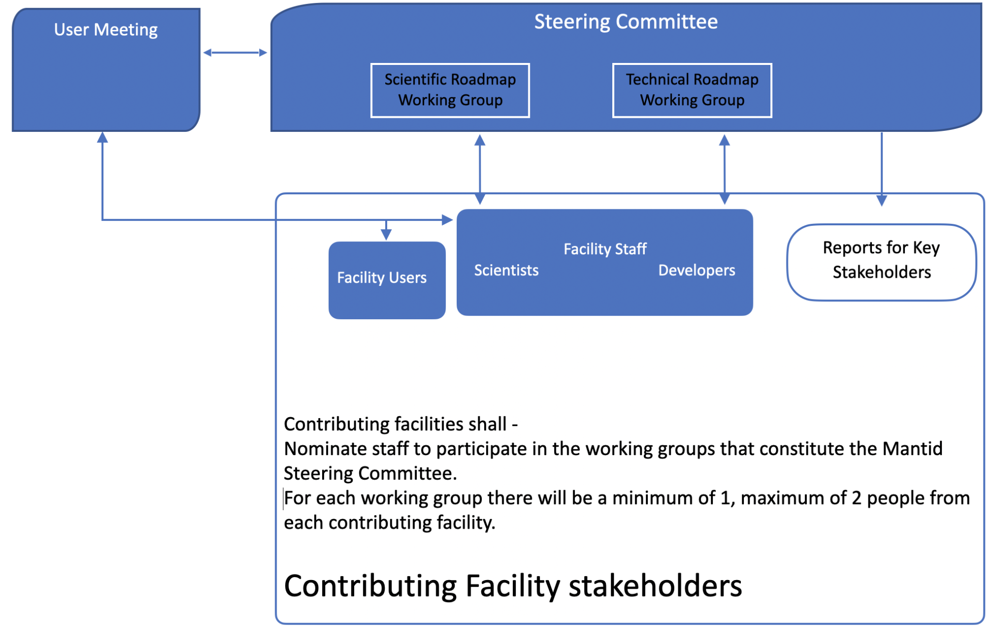
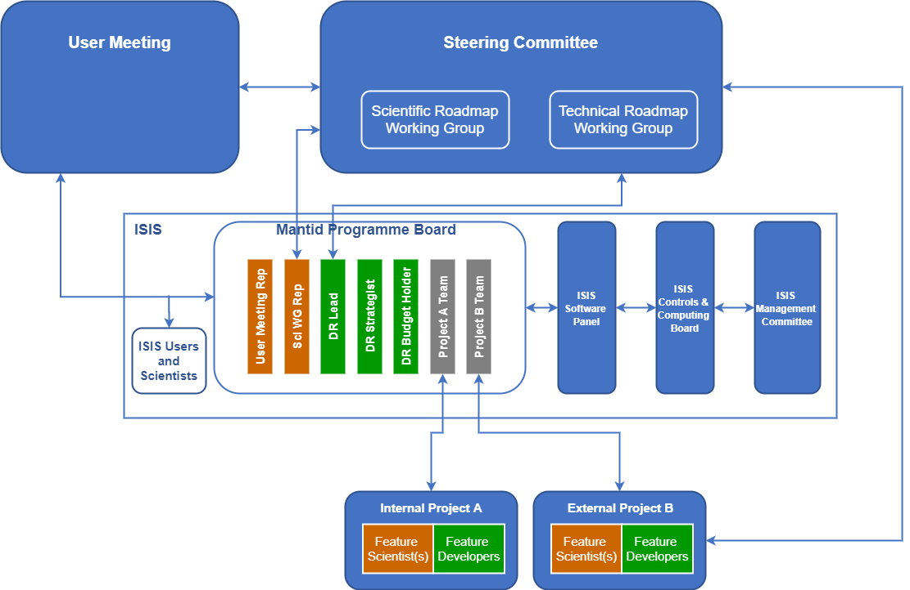
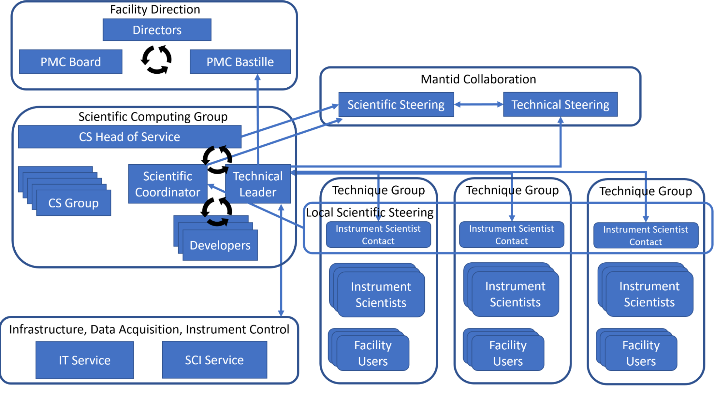

# Mantid Collaboration Governance Model

Purpose of this document
========================

This document describes the governance framework for the Mantid Collaboration.
The history of the governance is stored in the [history file](history.md).

(The key aims of this governance model are: i.e. explain what is purpose is!)

Governance Structure
====================

This section describes the revised governance structure for the Mantid Collaboration (starting in 2026?).
Figure 1 shows a representation of the cross-facility Working Groups at the collaboration wide level, and its interaction of with contributing facilities.

The box labelled "Each Contributing Facility" represents a simplified map of the stakeholders at any research facility that acts as a Contributing Facility.
These include facility scientists and Mantid developers and facility users, and "board" of some kind that oversee and prioritise Mantid needs for a single facility. The latter will vary from a single developer and one or more scientists meeting informally to discuss prioritise and needs to a formal board meeting on a regular cadence to discuss and prioritise Mantid requirements across 20+ instruments. The Mantid governance model does not perscribe how such a "board" is setup or run, but assume there is some form of local setup such one person from this setup will be attending the recurrent Technical working group (TWG) meetings.

One role of the TWG is to keep up date a Committed Mantid Roadmap. This roadmap will contain large work items that are needed to keep Mantid operational and deployable on the OS platforms that facilities requires it to run on, and any new user capabilities that one or more facilities have committed resources for and the TWG have been informed about.

More specifically the Collaborative components of the model are:

* Technical Working Group (TWG) - maintain and update a Committed Roadmap and responsible for running Mantid Developer Workshops
* Scientific Communication Working Group (SCWG) - discuss ideas for scientific communication and responsbile for running User Meetings
* Optional: Scientific Discussion Working Group (SDWG) - in addition to discussion that already takes place the idea of this working group is an addtional place for early and ongoing to discuss ideas for user facing enhancements to Mantid
* Optional: Governance Model Working Group (GMWG) - its purpose is to ongoing review this governance model including to help stimulate that it is approximately kept up with how the governance of Mantid is in reality operating

Examples of local facility management and how it will interact with the Collaboration governance are given in the Appendix.

**Fig 1. Representation of the interaction between the Mantid governance and stakeholders in Contributing Facilities. The nominal limit of Steering Committee size is implemented as an initial way of working that will be adapted as necessary.**

The governance structure is developed to stimulate collaboration, where appropriate, resulting in open source code base or common code and that is developed and maintained in a collaborative way.
This model allows individual facilities to develop Mantid according to their own requirements, with accountability for delivery and resource management to their own executive management, while leverage collaboratively working where this is of mutually beneficial.

The leading philosophy of Mantid development is that:
* The Mantid Collaboration seeks to coordinate individual contributions to a free open source software (FLOSS) project.
* Facilities (Facilities in this context refers to research infrastructures such as ISIS, SNS and ILL) act as contributors to an open source software development.
This document refers to such facilities as "Contributing Facilities".
  * Mantid is open to new Contributing Facilities providing that those facilities agree to the terms listed below and can commit their own resources to develop the framework for their needs.
* Individual contributors are welcome and do not need to be part of the formal organisation or a member of a facility.
They are referred to in this document as “Individual Contributors”.
  * Becoming an Individual Contributor is an open process which is defined at a technical level by the workflow for contributing code.

In this model the term Contributors refers to a facility or group that contributes to the Mantid development. The Collaboration also welcome Guests including to learn more about the Collaboration before considering requesting membership.

**Contributing Facilities shall**
* Resource the development according to the required use by the facility (i.e. each Contributing Facility will have sufficient level of effort available to resource their own specific development of Mantid. As such the collaboration is a do-ocracy, in a similar way to other scientific software developments such as SASView (https://www.sasview.org/).).
* Provide own local management, requirement gathering process and development.
* Nominate members to the non optional Working Groups.
* Help Mantid products remain FLOSS.
* Adhere to the development workflow and standards for code quality set out by the TWG.
* Contribute to maintenance and testing activities.
* Be open to suggestions and feedback from Individual Contributors to the project.

**Contributing Facilities should**
* Contribute to infrastructure costs.
* Maintain a level of effort, expertise or capability in Mantid.
* Host (and fund) the annual User Meeting and Developer Workshop.

3.1 General to all Working Groups.
-----------------------
All Working Groups (WGs) runs on a consensus driven basis.
They are composed of membership as detailed below and in subsections below. 

A primary objective is to provide a space for discussions between facilities to encourage coordination and collaboration.

**Membership.**

Each Contributing Facility should nominate at most two members per WG.
Individual Contributors are welcome WG meetings and membership is not required in order to contribute to Mantid.
Those who contribute effort are allowed to do so in a way that benefits them, but should keep the needs and concerns of others using Mantid products in mind.

**General Responsibilities of the Working Groups.**

* Hold a list of its members.
* Hold recurrent meetings with publicly circulated agendas and meeting minutes with records of decisions made.
* Be inclusive of Individual Contributors.
* Keep meetings open to invite guests in the form of Individual Contributors, people who have a special interest and knowledge of a topic, and people interested in experience the working of a collaborative WG before requesting membership. Guests cannot cast a vote when votes are held in WG meetings.

**General Responsibilities of members of the Working Groups.**

* Communicate the facility’s interests and intentions to the Working Groups.
* Communicate the Working Group discussions to their facility management.
* Be open to discussion of topics and work towards solutions that foster commonality through consensus.
* Attending the Working Group meetings regularly or sending a delegate where this is not possible.

Below is an example of how the frequency of WG meetings could be (as of Nov 2025, this is how these are run for the TWG).

| Jan  | Feb  | Mar  | Apr  | May  | Jun  | Jul  | Aug  | Sep  | Oct  | Nov  | Dec  |
| ---- | ---- | ---- | ---- | ---- | ---- | ---- | ---- | ---- | ---- | ---- | ---- |
| GMWP |      |      |      |      |      |      |      |      |      |      |      |
| TWG  | TWG  | TWG  | TWG  | TWG  | TWG  | TWG  | TWG  | TWG  | TWG  | TWG  | TWG  |
|      |      | SCWG |      |      | SCWG |      |      | SCWG |      |      | SCWG |

*Table 1: An example frequency of meetings for the collaborative Working Groups. The cadence of User Meetings and Developer Workshops are determined by the SCWG and TWG respectively. In terms of in-person Developer Workshops running these yearly or similar is strongly encouraged, where these historically have provided strong benefits for the collaboration. Similarly in-person User meeting have been very beneficial (including the Nov 2025 meeting) and it is highly recommended (e.g. from the Nov 2025 User meeting) to periodically run such e.g. yearly. Historically, in-person developer and user meetings have run side by side although there is no requirement that they are. In addition virtual versions of developer and user meetings are encouraged.*

3.2 Governance Model Reviews and the GMWG
--------------------------------------------

* Coordinate the review of the governance model (this document and associated documents).

The Steering Committee will be responsible for the review of the governance of the Mantid project at a suitable frequency.
This will be coordinated by the chairs of the Technical and Scientific Working Groups.
Key elements of this review process will include:
* External reviewers where appropriate.
* An evaluation of whether the governance is facilitating or hindering collaboration.
* Updates to the governance in the spirit of continuous improvement.

3.3 Process for Resolving Conflicts
-----------------------------------

In the unlikely event where the collaboration has reached an impasse, members will resort to the use of a third party conflict resolution process.
The chairs of the Scientific and Technical Working Groups will be responsible for invoking this resolution procedure.
The pair will document the issue/s and prepare a summary which will be sent to all participating facility directors.
The facility directors will then be invited to assume a mediation/arbitration role in a joint Steering Committee meeting which comprises the combined Scientific and Technical Working Groups.
The conflict will be presented to facility directors in detail providing each interested party to state their case.
If directors are unable to mediate a resolution, they will arbitrate the dispute and force a final decision thus providing a way out of deadlock.
The need for this conflict resolution is expected to happen very infrequently, and since the introduction of the 2021 Governance model and now, Nov 2025, it has not been invoked.

3.4 Technical Roadmap Working Group (TWG) and the Committed Collaborative Roadmap (CCR).
----------------------------------------------------------

The Technical Working Group (TWG) owns the Comitted Collaborative Roadmap (CCR) and coordinates technical discussions and discussion related to items/topics on the roadmap, with an emphasis on those that concerns multiple faciliities.

**Committed Collaborative Roadmap (CCR).**

The CCR is composed of broadly two following two catagories of work items/topics: 

* (large) work items needed to keep Mantid operating and being fit for the the future. For example, existtential work to keep up to date with 3rd party dependencies such as Python and Qt, keep the development pipeline functional, keep Mantid deployable on relevant platforms, keep a tap on technical debt, handle future instrument data rate and read/write rates, security etc. Individual facilities built their roadmaps at each facility to identify their local needs. The wider Collaborative roadmap is structured as a set of topics for which one or more Contributing Facilities will assign resources (or in the case of an Individual Contributors, will undertake the work). In addition, discussions between TWG members may identify new existential Mantid needs that in return TWG members will communicate back to individual facility management board/committees/other, to stimulate awareness of such and stimulate discussions on resource implications. When resource from one or more facilities has been committed to such work the corresponding item ges associated with a future release on the CCR.
* (large) work items to enhance Mantid with new capabilities such as to handle of new instruments and instrument upgrades, improving the scientific accuracy of data reduction for a specific technique, support of new type data reduciton, user usability needs etc. as needed by individual facilities. Work items of this kind only appear on the CCR once at least one facility has committed resources to do the work. By making such work visible on the CCR the whole collaboration can see what is upcoming. As an optional bonus other facilities may volunter to contribute to such works. For instance, with additional scientific validation testing, PR review testing and/or direct coding contributions.

There will naturally also be topics that might be argued to into both of the above two catagories such as: Mantid specific needs to help support external live streaming infrastructure or other facility software infrastructures, cross-cutting instrument geometry changes, deprecation or support for compatibility with new 3rd party software interfaces.

Work on applications that leverage Mantid (e.g. as a library) and are outside of the Mantid collaboration will not be listed on the CCR. 

The roadmap is managed using Agile with a kanban-style representation. It is reviewed at each of the regular meetings of the Working Group.
This visual style is aimed at facilitating effective communication of the current status, complexity and interdependencies.
Topics in the roadmap are detailed enough to foster communication, while broad enough to be relevant to multiple contributors.

Example roadmap topics include:
* File loading performance for neutron event data.
* Live streaming and infrastructure.
* Instrument geometry rendering.
* Data structure performance.
* Compatibility with external software ecosystems (e.g. pandas or PACE).
* Componentization of scientific interfaces
* Other applications such as imaging or auto-reduction which do not sit within data reduction as such.

**Membership of the TWG.**

The base membership of the Working Group will include:
* An elected Chair.
* A elected Secretary. The secretary can be external to the TWG (and not a voting member of the TWG).

Membership of the TWG is determined by each facility.
Facilities nominate senior technical staff who are involved in local facility roadmaps discussions.
The members of the TWG should have a deep technical knowledge and experience over a wide range of programming, best practices, infrastructure areas and awareness of facility users needs that related to Mantid.
New members are approved by the existing Working Group.
Members must have the  authority to discuss and agree the contributions to the Collaboration roadmap.

Individual Contributors can self-nominate to attend TWG meetings as guests, or be invited by the TWG.

The existing membership will consider and approve members on merit.

**Responsibilities of the TWG Chair.**

The TWG chair is responsible for:
* Ensure the CCR gets discussed and updated at each TWG meeting.
* The chair will act as “Lead Coordinator” of the overall direction and health of Mantid.
This ensures decisions on significant technical issues will not get stalled by the various committees.
* Resolving conflicts in the technical roadmap which cannot be resolved by consensus.
* Calling regular meetings of the Working Group (The elected Secretary might do this instead).
* Attend Developer Workshops and User Meetings

**Responsibilities of the TWG Secretary.**

* Calling regular meetings of the Working Group (if this is not done by the chair).
* Write meeting minutes that communicates decisions made that affects Mantid. Include brief high-level summary of discussions. Minutes should be consumable by other Mantid contributors.

**Responsibilities of TWG Members.**

The Working Group members are responsible for:

* Providing and maintaining resourcing levels on agreed roadmap items.
* Communicating progress to their local facility management.
* Translating benefits of combined projects to their local facilities.
* Communicating changes in priorities at local facilities which may affect the overall technical roadmap.

**Terms of Reference.**

The Technical Roadmap Working Group is responsible for the following activities and processes:

* Help facilitate coordination between Contributors.
* Hold and maintain the development risk register that is only concerned with keeping track of known risks that may risk contributing facilities can't deploy Mantid on relevant facility user platforms or contribute back to the Mantid code repositories.

* Partners the Scientific Roadmap Working Group as equal members within the Steering Committee.
* Senior managers who have significant control or influence over data reduction resource within their respective facilities.
* Creates and delivers a technical roadmap for the Collaboration.
* Communicates the technical roadmap to the Scientific Roadmap Working Group and changes as they take place.
* Working Group members should encourage experts in key areas to attend where appropriate.
* Provides technical grounding for items in the scientific roadmap created and owned by the Scientific Roadmap Working Group.
* To come up with the best technical solutions for a given major and submitted problems.
* Promotes consensus on infrastructure and processes.
* Coordinates and advises on major designs.
* Coordinates changes to the third party dependencies of Mantid and makes recommendations for changes and updates.
* Ensures there is a good distribution of developers with administrator privileges for services.
* Acts as an arbitration and triage point for conflicts.
* Overseeing, resourcing and scheduling large-scale refactoring effort.

The Technical Roadmap Working Group operates on the following basis:
* The Working Group will meet at least monthly online.
* The Working Group will meet face-to-face at least annually as a satellite to the User Meeting.
* All members of the Steering Committee are invited to attend meetings.
* People can be invited to meetings who have a special interest or insight in a topic that cannot be channeled through a Working Group Member.
* The technical roadmap is reviewed at every meeting as the first agenda item.
* The Working Group organises the annual face-to-face Developer Workshop and the virtual Developer Workshop.
* Membership is determined by Contributing Facility recommendations or (self-)nomination of Individual Contributors.
New membership is approved by the existing membership.
* The Working Group will elect a Chair from within the existing membership.
* The position of Chair is for a fixed term appointment, reviewed annually by the Working Group.
* Holds a list of its membership.
* The agenda and minutes of Working Group meetings will be published publicly.
* The Working Group can be contacted by anyone outside the Collaboration via a mailing list.

3.5 Scientific Communication Working Group.
------------------------------------------------------------

The Scientific Roadmap Working Group owns the common five year scientific roadmap.
This group will meet every three months to review and update as necessary the scientific roadmap in accordance with the common development plan and Contributing Facilities’ evolving scientific roadmaps.

**Scientific Roadmap.**

The scientific roadmap for the Collaboration will be composed of common areas for scientific development.
Each individual facility will be responsible for creating its own scientific roadmap alongside its own technical roadmap through processes that it sees as fit for its own local management of Mantid.
The scientific roadmaps from all Contributing Facilities will be shared in the Scientific Roadmap Working Group, along with input from Individual Contributors and the User Meeting.
Common requirements will be identified and initiated as projects between those Contributing Facilities that assign resources, and Individual Contributors who undertake to contribute effort, that will enable the projects to be completed.
Projects will be reviewed at each Working Group meeting as part of the constant review and updating of the common scientific roadmap.
The management of common projects on the 12 month view is the responsibility of the Technical Roadmap Working Group, which will review common projects at each meeting so that any issues or delays can be addressed.

The Steering Committee and Scientific Roadmap Working Group own a common - not a global- scientific roadmap.
It is not the intention that they own the totality of the roadmap of all facilities, or to attempt prioritisation of scientific requirements for any single Contributing Facility.
The common roadmap is developed to enable collaboration on areas of common interest.
The Scientific Roadmap Working Group has access to the roadmaps of all the Contributing Facilities in order to identify and promote collaborative projects.

**Membership of the Working Group.**

The base membership of the Working Group will include:
* An elected Chair.
* The Chair of the Technical Roadmap Working Group
* At least one person, but a maximum of two, per Contributing Facility.
* A secretary elected on a permanent basis.

The Chair is elected from the current membership of the Working Group.
Additional representatives from the Technical Roadmap Working Group can be co-opted as required to provide specialist technical input.
The meeting is open for any members of the Technical Roadmap Working Group to participate in if they choose.

Membership  will primarily (It is expected that most members will be facility staff.
The Scientific Roadmap Working Group is open to membership from non-facility staff.
Individuals should communicate their willingness to join the Working Group by contacting the Chair of the Working Group) be via nominated staff from facilities.
It is expected that nominated staff will have a good understanding of the development and of their facility roadmap.
Members must have the authority to discuss and agree the contributions to the common Collaboration roadmap.

**Responsibilities of the Working Group Chair.**

The Working Group chair will be responsible for:
* Presenting the scientific roadmap to the Technical Roadmap Working Group.
* Working with the Technical and Scientific Roadmap Working Groups to tension technical roadmap priorities against scientific roadmap priorities for development.
* Raising issues with the Technical Roadmap Working Group and share with members of the Scientific Roadmap Working Group.
* Informing the User Meeting of the scientific roadmap and acting as an interface between the User Meeting and Scientific Roadmap Working Group.
* Calling extraordinary meetings of the Scientific Roadmap Working Group as needed.
* Attending the User Meeting.

**Responsibilities of Working Group Members.**

The Working Group members will be responsible for:
* Presenting Contributing Facilities roadmaps to the Scientific Roadmap Working Group
* Communicating changes in the local facilities roadmaps to the Scientific Roadmap Working Group
* Communicating the scientific roadmap to their local facility management and Mantid governance

**Terms of Reference.**

The Scientific Roadmap Working Group is responsible for the following activities and  processes:

* Nominate the Chairs of the User Meeting who have authority to engage a local organising committee for each User Meeting.
These individuals do not need to be members of the Steering Committee.

* Create and deliver the scientific roadmap for the Collaboration.
* Communicate the common scientific roadmap to the Technical Roadmap Working Group.
* Communicate the Contributing Facility scientific roadmaps to the Technical Roadmap Working Group.
* Promote and foster collaboration between contributors by finding commonalities which could involve two or more Contributing Facilities which could then evolve into projects in the common scientific roadmap.
* Work with the Technical Roadmap Working Group to ensure that the scientific priorities are satisfied with technically feasible solutions.

The Scientific Roadmap Working Group operates on the following basis:
* The Working Group will meet at least quarterly online.
* The Working Group will meet face-to-face at least annually as a satellite to the User Meeting.
* All members of the Steering Committee are invited to attend meetings.
* People can be invited to meetings who have a special interest or insight in a topic that cannot be channeled through a Working Group Member.
* The scientific roadmap will be reviewed every meeting as the first item on the agenda.
* Membership is determined by Contributing Facility nomination.
* The Working Group will elect a Chair from within the existing membership.
* The position of Chair is a fixed term appointment, reviewed annually by the Working Group.
* Holds a list of its membership.
* The agenda and minutes of Working Group meetings will be published publicly.
* The Working Group can be contacted by anyone outside the Collaboration via a mailing list.

**Features of the Mantid Scientific Roadmap.**

* The roadmap will be a high level scientific outlook on a technique-by-technique basis.
  * Inputs will be based on milestones and deliverables for each technique area as included in each of the Contributing Facilities shared roadmaps.
  * The output will be a distillation of the shared roadmap needs from a discussion within the steering group
  * The roadmap shall highlight common aspects.
  * The roadmap will provide horizon scanning, including new instruments and techniques.
  * Contributors are encouraged to share scientific outlooks that are not necessarily  envisioned to be developed within Mantid. (Specific exclusions from the Mantid roadmap are useful. A collective view on scientific computing across the Contributing Facilities helps to identify and define the scope of the overall project.)
* The formation of the roadmap will be an iterative process. At one meeting of the Scientific Roadmap Working Group areas for collaboration on projects will be identified from the Contributing Facility roadmaps; outside the Working Group these will be formulated by the interested Contributors into projects, and incorporated into the Mantid development in a subsequent meeting.
* The technique areas to be considered could include:
  * Powder diffraction
  * Single crystal diffraction
  * Macromolecular crystallography
  * Engineering diffraction
  * Disordered materials
  * Small angle neutron scattering (SANS)
  * Reflectometry
  * Imaging & computed tomography
  * Spectroscopy
    * Direct geometry
    * Indirect geometry
    * Triple axis spectrometer
    * Neutron spin echo
    * Deep inelastic
    * Quasi-elastic neutron scattering (QENS)
    * Muon spin rotation

3.6 User Meeting and Developer Workshop
---------------------------------------

These meetings will be organised with the aim of enabling an effective  connection between contributors and users of Mantid and the applications produced using the Mantid framework.
There will be two meetings held back-to-back: the first centered on scientific usage and needs (User Meeting), and the other centered on technical discussions (Developer Workshop).

**User Meeting**

The Collaboration shall organise an annual face-to-face user meeting. The Steering Committee will facilitate this by:
* Electing a Chair for the meeting.
* Agreeing on a host and date for the meeting.
* Ensuring there is a point of contact in each Working Group who is willing to help identify key themes for the meeting.
* Providing a list of contacts for Individual Contributors with whom local contributions to the meeting can be discussed.

The elected chair will organise the meeting with the aim of:
* Informing users on the latest news and ‘hot’ topics relating to the Mantid collaboration.
* Promoting interaction between contributors to stay abreast of new advances in techniques for data reduction/analysis across different scientific areas.
* Promoting interaction between developers and scientists to improve understanding of scientific requirements and technical constraints.
* Identifying common areas of development between contributors, and promoting collaborative work both through immediate discussion and in feedback to the Steering Committee.
* Discussing new technologies/infrastructures which may be leveraged to enhance the user experience.
* Addressing both technical and scientific topics, and providing constructive feedback to the Steering Committee as to whether the respective roadmaps are meeting user needs.

The elected chair will make a report to the Steering Committee following the User Meeting.

**Developer Workshop**

This annual face-to-face meeting is organised by the Technical Roadmap Working Group and is organised alongside the User Meeting.
There may also be additional virtual Developer Workshops throughout the year.
The Technical Roadmap Working Group is responsible for creating an agenda for the meeting.

The purpose of the Developer Workshop is as follows:
* Promote interaction between developers, from both Contributing Facilities and Individual Contributors.
* Run code camps to work on backlog issues (defined by the Technical Roadmap Working Group) or issues that benefit from a more interactive approach to problem solving.
* Discuss new technologies and infrastructures which may be leveraged to enhance the project.
* Gather feedback on day-to-day working practices and identify points for improvement.

Appendix: Example for interaction from a Contributing Facility
==============================================================

The diagram below provides ISIS-specific detail on the interaction with the wider collaboration governance.
This represents a concrete example  of how a facility might interact with the collaboration-wide governance.
ISIS intends to have an internal Mantid Programme Board which comprises scientists and technical leads who determine the ISIS-specific roadmap for Mantid.
They will have sufficient authority within the facility to make decisions regarding the direction of Mantid-based data reduction and analysis software development on behalf of ISIS.
This body will decide which projects constitute the Mantid programme of work, in line with the local scientific and technical roadmap that the body creates and owns.
The board will report to internal management structures so they can have a view of whether the project is continuing to deliver for the facility.
The project-based approach, if adopted by other facilities, will allow for a better understanding of areas of overlap and the timing of such developments.
Technical leads will schedule the resources within the development team to deliver against this roadmap.

Key features of the ISIS approach are:
* The Mantid Programme may consist of projects which are completely external or shared development with other facilities.
* These projects will arise from the internal scientific/technical roadmaps.
Roadmaps will be developed as the result of a series of deep-dive requirements gathering workshops within each science group.
* The technical requirements which satisfy the scientific roadmap will be extracted as part of this exercise.
Purely technical requirements will be consumed from the development team.
* The local scientific roadmap will be developed by the Data Reduction Strategist (this is one aspect of the person responsible for the overall ISIS Scientific Computing strategy) and the Scientific Roadmap Working Group Representative.
They have the delegated authority to decide on projects which satisfy the data reduction computing requirements for the facility.
* The local technical roadmap will be developed by the Data Reduction Lead and the Data Reduction Budget holder in line with the scientific computing strategy for the facility.
The technical roadmap will deliver the requirements stemming from the scientific roadmap as well as any purely technical requirements which are prerequisites for the fulfilment of the scientific requirements.
* Each ISIS representative on the Scientific andTechnical Roadmap Working Groups will communicate the local ISIS roadmap to those Working Groups.
Collaborative projects will be created out of areas of common interest, however, they will also maintain a distinct internal representation.

The diagram below shows the local ILL implementation with respect to the steering committee (Mantid Collaboration):

